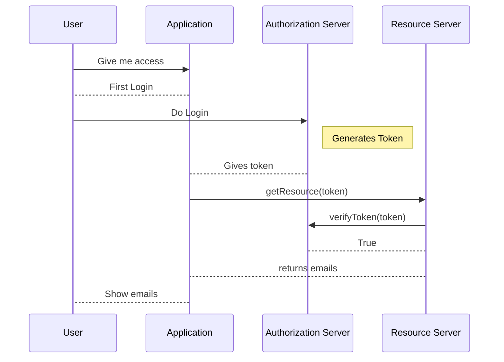

## Implementing APIs

### MVC

MVC is an acronym for model-view-controller. There are design patterns we can employ to structure code. One such design pattern used to structure the APIs we create is called MVC design pattern.

Assume the entity that calls our API is called the client. If the client wants some information, should they be able to access the database directly? No, as this can lead to security concerns. Instead, the client should go to a server and the server should talk to the database. 

MVC pattern is used to structure the code in the server. The controller is the entity that should first receive the request. The controller layer will parse the data in the request and call the relevant functions in the application. The layer that performs the business logic is called the service layer. So, the controller layer will talk to the service layer to get work done. The service layer can directly talk to the database to create a new record or to read the data stored, however MVC pattern requires a repository layer between the service layer and the database. This allows for flexibility in changing the database in case our requirements change in the future. The respository layer talks to the database. 

In MVC, M stands for model. Models are blueprints of entities that we store in the database. Model class will not have any business logic. 

C stands for controller that is the layer between the client and the service layer.

V stands for view. In the past, backend used to generate the UI for frontend as well. This layer was called the view. These days view is managed by frontend frameworks like React etc. 

In a nutshell, MVC is just SRP for APIs.

### REST Practices

Like we have SOLID/design patterns for structuring general code, MVC for building APIs, we have REST best practices for how APIs should be named. 

All the APIs should be structured around the resource they are working with. The type of action an API is performing should not be a part of the API endpoint. For example, if we are creating a user, the API endpoint should not be /user/create. The type of action should be defined by the HTTP method type and not by the URL. 

Every API is an action on one of the models. 

The type of action should be specified by the method type and not by a verb in the URL.

The types of HTTP methods are

1. GET - To fetch a resource from the server.
2. POST - Create a resource in the server.
3. PATCH - Partially update attributes of a resource on the server.
4. PUT - Replace a resource on the server. This amounts to a complete update of the resource in the server.
5. DELETE - To delete a resource from the server.

Resources are like folders. Think of every entity as an item in the folder. When we create a new user, we are adding a new item in the users folder. So the end point should be /users. When getting details of all/multiple users, then the end point should be /users. If we are getting a particular user, then the end point will be /users/1, where 1 is the user id. 

REST APIs should be stateless. This means that a request should not be dependent on a previous request and that it should be self-sufficient. This is because a request from a user can go to any server in a distributed system. Maintaining the state for a user in a server and ensuring that all requests from a user go to the same server is impractical when the system is serving millions of users. Each HTTP request should contain all information that will help the server respond to the request.

There is no need to maintain a 1:1 mapping of API calls with database tables. A chatty API does not return all the relevant data in one go. In such cases, the client is forced to make multiple API calls to get the relevant information. When building an API, include all relevant information in the response to a request to that API so that the number of API calls can be kept to a minimum. 

REST has no constraint with respect to the data type of response. Response can be sent in multiple formats like JSON (most recommended format), XML, protobuf etc.

## Project Requirements and Microservices

### Microservices - Why do we need them?

In a system like Scaler, what are the various features/functionalities provided?

- Authentication
- Live/Recorded Classes 
- Dashboard
- Assignements
- Career Platform
- Mailing Portal

Assume Scaler creates a single codebase where every functionality is present in a single codebase. This will lead to a huge codebase. What are the issues with a huge codebase? 

1. Compiling a codebase with thousands of classes and application startup will take a lot of time. Hence any fix/update of the codebase will take a lot of time to take effect as the entire codebase will be recompiled and restarted.
2. Code will be overwhelming to understand.
3. Inter team conflicts while deploying etc.
4. Complete application requires a single techstack. This will lead to legacy issues. As technology and frameworks eveolve, there may appear better tools to provide certain features/functionalities. Using a new technology or framework is difficult when we have a single codebase.
5. Inability to selectively scale. Every part of the application does not require the same scale. Using a single codebase will hinder the ability to selectively scale certain applications of the project. 


Once the codebase is split into microservices, each of these services can run on a seperate server and have their own database. These microservices will talk to each other using API calls. 

## Frameworks

Framworks help us build applications efficiently by providing common functionalities out of the box.

### Why do we need frameworks

As codebases evolve, they will have many functionalities and they will be doing many similar things. For example, some of the similarities will be authentication related flow, APIs, talking to databases, logging etc. 

When we build an API, we will need an application to run on a server and receive requests over the internet. The operating system of the server will have to receive the request and pass the request to the appropriate application. The application will have to parse the data received with the request, process it and respond to the request.

If we had to write the code to handle this without a frameowrk, we will collect the data from the request in bytes and convert it into the relevant datatype and then process it in the application. Doing this amounts to reinventing the wheel. 

Instead of this, we should follow the best practices of handling data securely, decrypting data, authentication, talking to databases and many other functions related to processing a request. Frameworks provide these best practices in the form of inbuilt and ready-to-use functionalities. 

### Springboot as a framework

Spring framework is a set of projects that allow easy creation of enterprise level Java applications. 

It is comprised of a core framework (core set of functions) and ADDONs (authentication, kafka, database, cloud). 

The core of spring framework is dependency injection.

#### Dependency Injection

This is a foundational concept in the spring framework. A framework doing dependency injection on our behalf is called inversion of control. 

Consider an attribute in a class. There are two ways the attribute can be assigned a value.

1. Initialize the value in the class. 
2. Inject the value of the attribute from outside the class. 

The benefit of the second approach is that it is better to create a dependency outside the class than creating it within the class. Why?

1. We can resuse the same object. 
2. Satisfies the dependency inversion principle which states that class A and class B should be loosely coupled through an interface. 
3. It makes the code easier to test

Whenever we create an application, there are many common dependencies that have to be injected in multiple classes. For example, multiple classes will have a dependency on a database. Spring provides an easy way to do dependency injection. 

Spring has something called beans, which are special objects that we provide to spring, so that they can be injected automatically when needed. Spring takes these objects and puts them in the spring container which is also called application context. 

While spring framework provided dependency injection, a lot of functionalities required for builing an application are provided by spring add-ons. Initially, to include add-ons we had to create an XML file just to configure them.

Springboot made the entire process of including add-ons easy, by automatically configuring add-ons using best practices, while retaining the ability to override it.  

#### Controllers

#### Services

When we have more than one implementation of a service interface, name each of the implementations and then in the Controller's constructor add @Qualifier("serviceClassName") so that Spring can inject the correct bean into the controller. 

#### Repositories

Repositories are written as interfaces that extend JPA

#### Models

All the classes from the class diagram become models in Springboot. These are the entities that we store in the database. Hence we have to annotate these classes with @entity. 

All tables in SQL need a primary key. We can select an attribute (usually id) and annotate it with @Id. A design choice we can follow here is the use of a BaseModel mapped superclass for common attributes like id, auditing attributes like createdAt and updatedAt and a boolean attribute isDelete that enables us to implement soft delete. 

##### Implementing Inheritance Types

1. Mapped Superclass
    
    - Annotate parent class with @MapperSuperclass
    - Annotate child classes with @Entity

2. Table per class

    - Annotate parent class with @Entity and @Inheritance(strategy = InheritanceType.TABLE)
    - Annotate child classes with @Entity

3. Joined Table

    - @Entity on the parent class.
    - @Inheritance(strategy=InheritanceType.JOINED) on the parent class
    - @Entity on the child class
    - @PrimaryKeyJoinColumn(name="parent_id") on the child class. This is the join column with the parent class.

4. Single Table

    - Annotate the parent class with @Entity.
    - Annotate the parent class with @Inheritance(strategy = InheritanceType.SINGLE_TABLE).
    - Annotate the parent class with @DiscriminatorColumn(name="userType",discriminatorType=DiscriminatorType.INTEGER).
    - We can also add @DiscriminatorValue(value="0") to the parent table
    - Annotate the child class with @Entity. Adding this will not lead to a table of the child in the database. It ensures that the attributes of child class will be there in the main table. 
    - Annotate the child class with @DiscriminatorValue(value="1").
    


### First Application using a Framework

We are going to use spring boot to develop a basic application. Initialize a springboot project using spring initializr extension in vscode. Select the springboot version, java version and build a maven project with the default names (com.example and demo) provided by the initializr . Add spring dev tools, spring configuration processor, lombok and spring web as add-ons in the project and save the project to your desired folder. Later, we will see what each of these add-ons do. 

Once you have opened the project in the code editor, create a new folder in the demo folder called controllers. Then create a file called HelloController.java. 


Three references on springboot

https://docs.spring.io/spring-framework/reference/overview.html

https://docs.spring.io/spring-framework/reference/core/beans/introduction.html

https://spring.io/guides/gs/rest-service


### Journey of a request in Spring

When a request comes to springboot, the request goes to a class called Dispatcher Servlet. This class routes the request to the appropriate controller by talking to someone called Handler Mapping class. It asks for the method to serve the particular request. The handler mapping has a map of the routes and their corresponding methods in the corresponding controllers. 

Upon receiving the method, the servlet will call the controller method with the relevant arguments. Once the controller passes on the request to the service and the service responds to the request, the controller sends the response back to the servlet. The servlet then sends the response back to the client.

### Fakestore API

https://fakestoreapi.com/docs

Some of the features of a product service are

1. Create product
2. Get details of a product
3. Search product
4. delete product

There are a couple of ways we can implement the product service

1. Using a database. Here, we store details of products in the database. When we create a product, the product service will create an entry in the database. When we request the details of a product, the product service will get it from the database.

2. Using a third party API provider. When a client requests the details of a product, the product service will get these details from the third party api.

We are going to focus on using a third party API provider to build the product service in this section. The third party API provider we will use is the Fakestore API. We will implement proxy APIs for the APIs provided by Fakestore. 

#### Building our Proxy APIs

The product service should support CRUD operations for products. Inorder to create the class diagram, we need to find the nouns in the requirements. 

1. Product. Fakestore stores id, title, price, category, description and image url of a product. The datatype of id is integer, title is string, price is double, category is another entity, description is a string and image url is also a string.

2. Category. This entity will store the id and name of the category. The datatype of id is integer and name is a string. 

Both these classes will become models in our codebase. These are the tables that will be created in the database. 

In general, the service in the controller should be an interface because we retain the flexibility to choose the implementation we want. 

We should use the RestTemplate library to call third party APIs. We need only one instance of such a class to make third party API calls. This one instance can be used by multiple services to make these API calls. So, it makes sense to instantiate this object as a bean that can then be used by multiple services. 

Important classes should be annotated so that Spring knows the existence of these classes. This helps Spring create the necessary beans and inject them to constructors and methods specified by us with the autowired annotation.

The code for getting all products from the fakestore api can be written like below

```
public List<Product> getAllProducts() {
        List<FakeStoreProductDto> response = restTemplate.getForObject("https://fakestoreapi.com/products/", List<FakeStoreProductDto>.class, null);
        List<Product> answer = new ArrayList<>();
        for (FakeStoreProductDto dto: response) {
            answer.add(convertFakeStoreProductDtoToProduct(dto));
        }
        return answer;
    }
```

However this will not work. Java will not allow converting to a list of objects, in this case fakestoredto, because of the way generics in Java work. 

A datatype that takes another data type as parameter is generics. These are generic datatypes. The class for List is defined as follows

```
class List <T> {

    add(T data) {}

    T get(int index) {}
}
```

Here T is a variable data type. This type of definition was introduced from Java 5. Before that the class was defined like this.

```
class List {
    add(Object a) {}
}

```

Java tries to maintain as much backward compatibility as possible. This means that a code written in previous version of Java should continue to work in the current version of Java. Inorder to do this, Java developers implemented type erasure. This means that paramterized type was checked only during compile time and not at run time.

If someone has declared a list<Animal> or list<Integer>, the parameter information is removed at runtime. At runtime, Java recognizes the list but not the datatype of data in the list.

You can check this by running the following code

```
List<Integer> l1 = List.of(1, 2, 3, 4);
List<Object> l2 = List.of(new Object(), new Object());

System.out.println(l1.getClass());
System.out.println(l2.getClass());
```

The output in both cases will be the same. 

So, runtime will not know that each item of the response should be converted to an object of FakeStoreProductDto and added to a list. As Java does not know this, each item is converted to a hashmap by default. 

Since the issue is with using lists, we can replace it wiht array and the problem goes away.

```
public List<Product> getAllProducts() {
        FakeStoreProductDto[] response = restTemplate.getForObject("https://fakestoreapi.com/products/", FakeStoreProductDto.class, null);
        List<Product> answer = new ArrayList<>();
        for (FakeStoreProductDto dto: response) {
            answer.add(convertFakeStoreProductDtoToProduct(dto));
        }
        return answer;
    }
```

Put method in restTemplate does not return the replaced object. Even though the fakestore API returns the replaced object, the put method ignores it.

Internally the put method in the restTemplate call the execute method. All the other HTTP methods call the execute method internally. Execute method is a low level method that even we can use to achieve customization while using restTemplate. 

```
public Product replaceProduct(Long id, Product product) {
        
        RequestCallback requestCallback = restTemplate.httpEntityCallback(product,          FakeStoreProductDto.class);
		HttpMessageConverterExtractor<FakeStoreProductDto> responseExtractor =
				new HttpMessageConverterExtractor<>(FakeStoreProductDto.class, restTemplate.getMessageConverters());
		FakeStoreProductDto response = restTemplate.execute("https://fakestoreapi.com/products/"+id, HttpMethod.PUT, requestCallback, responseExtractor);
        return convertFakeStoreProductDtoToProduct(response);
    }
```

The httpEntityCallback method takes the request body and the respnse type as inputs and returns a requestCallback. Then we call the execute method with the relevant arguments and get the response as an object of FakeStoreProductDto. Thus we can now respond with the replaced object which was previously not possible with the put method. 

In order to make patch requests using resttemplate, we need to add a dependency

```
<dependency>
	<groupId>org.apache.httpcomponents.client5</groupId>
	<artifactId>httpclient5</artifactId>
	<version>5.2.1</version>
</dependency>
```

#### Handling Exceptions in APIs

Any request goes to the controller first. Exceptions can be thrown from controller. For example, in the absence of mandatory parameters or if the values of some parameters are wrong, then exceptions can be thrown. 

Services can also throw exceptions. For example, in case of a request to get all the orders of a user, if the user does not exist, then the service should throw an exception. 

Repositories can also throw exceptions. For example, if the database connection was interrupted, then repositories should throw exception. 

Exceptions can be thrown from any point in a request path. When an excpetion is thrown from a method, then these excpeptions should be caught and handled. This means, the method call should be wrapped in a try catch block. In the catch block, we handle the exception. 

If an excpetion is thrown from the controller, then the client cannot handle the exception. Frontend cannot catch exception from the backend. This means that, when an exception is thrown, the entire stack trace will be visible at the frontend. Even if exceptions are thrown from the service or repository layer, if it is not handled, the entire stack trace will be sent to the client side. This is a security issue. 

We should handle excpeption gracefully and send meaningful responses to the client in case an exception is thrown. 

Handling different types of exceptions in the controller will lead to the code becoming large and clunky. 

To handle the above issues, Spring provides Controller Advice. Any exception thrown in the spring application will pass through the controller. Controller Advice is an additional check on responses returned by the controller. It can also modify data that is being returned to the client.

To make a class a controller advice, we have to annotate the class with @ControllerAdvice. Now we can define exception handlers within this class. The code will look something like this.

```
@ControllerAdvice
public class ControllerAdvice {

    @ExceptionHandler(ArrayIndexOutOfBounds.class)
    public Response arrayOutOfBounds() {
        ...
    }
}
```

We can have exception handlers in the controller class itself in case we want to send controller class specific messages while handling exceptions. 

```
// When exception is thrown from the controller, this class level handler will be 
// called.
@ExceptionHandler(ProductNotFoundException.class)
public ResponseEntity<Void> handleProductNotFoundException() {
    return new ResponseEntity<>(HttpStatus.FORBIDDEN);
}
```

### Introduction to Spring Data JPA

When interacting with a database, an application does the following things

1. Create tables
2. CRUD operations

In relational database, there is a close relation between class diagram and schema design. This means if there is a class, then there will be a corresponding table in the db. The attributes of the class will have corresponding columns in the database. 

Writing SQL queries for CRUD operations ourselves can be cumbersome. There are libraries called ORM libraries that make this task easier. ORM stands from Object Relational Mapping. They provide an easy way to interact with database based on the models in our codebase. 

They provide functionalities like

1. Automatically create tables based on the models we have defined
2. Automatically get/update data from the db.
3. Based on the name of the method, ORM can create queries for us.

Hibernate is the most popular ORM library in Java. There are other ORM libraries like MyBatis, JOOQ.

Java also provides an interface that are implemented by different ORMs called JPA. JPA is called Java Persistence API. This way we can code our application to the interface rather than a direct coupling with Hibernate or MyBatis etc. 

Hibernate supports multiple databases like MySql, PostgresSql etc. Hibernate does not have code for talking to every database. This is where JDBC comes in. JDBC is an interface that has common methods like connect, save, insert, executeQuery etc. This interface is implemented by individual databases. For example, MySQL will have a MySQLJDBCConnector, PostgreSql will have a PostgreSQLJDBCConnector and so on.

The code in these connectors talks to the database. Any database that has JDBC implementation will work with Hibernate because Hibernate talks to JDBC.

### Database Setup

Add Spring-starter-jpa dependency to pom.xml from mvnrepository. After that add the mysql-connector dependency to the pom file. 

### JPA Queries

#### Query Methods

In declared queries, we write a method name and the ORM will create a query based on method name. There are two parts to the method name, the part before by and the part after by. We can find the prefixes in supported query method subject keywords. We can find the part after by in supported query method predicate keywords and modifiers. 

The part before by is the type of query we want to run. The part after by is the condition based on which records are fetched.

In derived query, suppose we want to query for products of a particular category by category id. One of the ways to do this, it to query the categories table with category id and get the category object and then use the object to query the product table to get the product list. This may make the API slow because there are 2 DB calls. We can instead write a method like this.

```
List<Product> findByCategory_Id(Long id);
```

The '_' allows us to access the attributes of the entity mentioned. 

There is one method that is used to create and update. This is the save method. If we pass an object to save without id, then the object record will be created and saved in the database. If the object is passed with id, then first check for presence, if yes, then update else save.


Hibernate Query Language, which is like SQL, is used when we dont want the ORM to create the query.

```
@Query("select p from Product p where price = ? and description like %?%")
List<Product> someName();
```

When do we use HQL? When creating a query method becomes complex or long. 

An advantage of using HQL is we can query for specific attributes instead of getting the entire row.

```
@Query("select p.id, p.title from Product p where price = ? and description like %?%")
List<Product> someName();
```

For this to work, the return type of the method should be an interface with get method of id and title attribute.

```
public interface ProductWithIdAndTitle {
    Long getId();
    String getTitle();
}
```
This interface is called projection.

Now the HQL method will look like this

```
@Query("select p.id, p.title from Product p where price = ? and description like %?%")
List<ProductWithIdAndTitle> someName();
```

HQL is database independent. It works across databases as hibernate converts HQL to a database specific query.

We can write native queries by including nativeQuery = true in the @query annotation.

```
@Query(value = "select * from product p where p.id = 5", nativeQuery = true)
List<ProductWithIdAndTitle> someName();
``` 

How do we get the parameters?

```
@Query(value = "select * from product p where p.id = :id", nativeQuery = true)
List<ProductWithIdAndTitle> someName(@param("id") Long id);
```

We might want to write specific SQL queries to have control over the query being executed. We may want to do this for enhanced performance. 

> Reference: https://docs.spring.io/spring-data/jpa/reference/jpa/query-methods.html

#### Representing Cardinalities

Consider products in an ecom store. Assume a product can belong to only one category. A category can have many products. The cardinality of this relationship is m:1. How do we represent this relation ship in Spring?

In the product class, we will have the following.

```
@Entity
class Product {
    @ManyToOne
    private Category category;
}
```

In the category class, we will have the following.

```
@Entity
class Category {
    private List<Product> products
}
```

The product attribute in the category class and the category attribute in the product class represent the same relationship. However, Spring does not know they are the same relationship by default. Hence Spring will end up representing the relationships twice. So, we have to tell Spring that they are the same relation. 

```
@Entity
class Category {
    @OneToMany(mappedBy = "category")
    private List<Product> products
}
```

This means that the relationship between products and category is mapped by the category attribute of the product class. This is possible with @OneToMany annotation and not @ManyToOne annotation.

Once the tables are setup, the products table will have a foreign key which is the category id. 

What happens when we delete a row from the categories table? There are a few ways we can handle this. 

1. Update the product category column to null.
2. Delete all the product rows associated with the category row itself.
3. Do not allow category to be deleted.

These are the generic ways to handle foreign key deletion. 

Spring provides us some ways to handle these operations.

```
@Entity
class Product {
    @ManyToOne(cascade = {CascaseType.All})
    private Category category;
}
```

In this way, if the product is deleted, then the category is also deleted. If product is updated and there is an update in the category, then the category is also updated. If product is created and category details are also provided, then a new category is created. What happens if the category already exists and it is not handled in the code. 

CascadeType.PERSIST will transmit the save operation. CascadeType.MERGE will transmit the update operation. CacadeType.REMOVE will transmit the delete operation. 

```
@Entity
class Product {
    @ManyToOne(cascade = {CascaseType.PERSIST, CascadeType.MERGE})
    private Category category;
}
```

The same concepts apply in many to many relationships as well. 

> Cascade Types: https://www.baeldung.com/jpa-cascade-types

#### FetchType and FetchMode

When a class has an attribute of another class, to fetch the details of that attribute, it will require us to do a join. This will make the query slow. If we need the values of the attribute, then we have no choice but to do the join and fetch the values. 

However, in cases where we do not these values, performing the join operation and fetching the values of the attribute will be wasteful. 

JPA supports two ways to fetch attributes of a child class. 

1. Eager fetch
2. Lazy fetch

In eager fetch, we fetch the details of the child class attributes while fetching the main object. Here we will need to perform a join operation. 

In lazy fetch, we do not fetch the details of the child class attributes while fetching the main object. These details will be fetched lazily. What does this mean? This means the details will be fetched in a seperate query if those details are requested. 

While lazy fetch, which means making a seperated database call, is not as efficient as a join operation, we prefer lazy fetch when the number of times we request for the attributes of the child class constitute about 10% of the number of times we request the main object. 

By default, all attributes are eager fetched other than collection attributes. Where can we change the default behaviour JPA? When we specify the cardinality of a relationship we can specify the fetch type as well.

```
@Entity
public class Category {
    @OneToMany(fetch=FetchType.EAGER, mappedBy="category")
    private List<Product> products;
}
```

Now let us talk about fetch modes. JPA ignores fetch modes. It is relevant when we directly use hibernate.

Consider this situation.

```
class Category {
    Long id;
    String name;
    List<Product> products
}

List<Category> categories = categoryRepo.findByNameStartsWith("s");
for (Category c: categories) {
    for (Product p: c.getProduct()) {
        sout(p.title());
    }
}

```

Let us say there are m categories and each category has n products. The number of ways to get the categories and all the products of the categories is as shown in the table below.

|2                                                                                            |m+1                                                                                           |m*n + 1                                                                                       |
|---------------------------------------------------------------------------------------------|----------------------------------------------------------------------------------------------|----------------------------------------------------------------------------------------------|
| Select * from categories where name like "s%"                                              | Select * from categories where name like "s%"                                              |  Select * from categories where name like "s%"                                             | 
| Select * from products p join categories c on p.c_id = c.id where c.id in [] | Select * from products p join categories c where c.id = {1}. Here we run these queries for each category id | Here select the product from categories, but for each product send queries to get details of  product |

The code is the same but JPA could decide to execute the code in any of the three ways. 

1. Whenever using ORM, read the queries that the ORM runs. If not optimal go for native queries. Usually ORMs run m+1 queries. 

2. We can also do this by telling JPA the fetch mode. JPA usually ignores fetch mode. Fetch mode usually works with hibernate.

> https://www.baeldung.com/hibernate-fetchmode, https://www.baeldung.com/spring-data-jpa-query, https://thorben-janssen.com/jpql/

#### Schema Migration and Versioning

ORMs handle table creation in general.

1. We might want to handle the table creation ourselves inorder to make optimizations that the ORM cannot do. 
2. ORMs do not do versioning of schema. We want to have versioning of database schema for multiple reasons. The primary one is being able to revert to previous schema when we revert to a previous code. In general, we want to track schema changes along with code changes. There are two schema migration/versioning libraries called flybase and liquibase. 

When we use a migration library, we have to maintain a db.migrations folder. When we make code change that also has schema change, we have to create a new SQL file with SQL query of that change. The SQL query is to create or update tables based on the schema changes. These files will be versioned. An additonal table is created in the database to track the versions of schema that have been applied. When we run code, flyway checks the table for last applied schema and will run the queries from subsequent versions.

When we use a schema migration library, we can set ddl-auto to none or validate. Validate is better because then JPA will check if all the required tables have been created for the app to run. 

## Repository Pattern

Code to interact with the persistence layer should be seperate from the business logic. Service layer takes care of business logic. The repository layer takes care of interacting with the database. If we need to change the persistence layer for any reason, we only need to implement a new repository code to interact wwith the new database. The service layer will stay the same. Hence the repository pattern promotes loose coupling.

## UUID

UUID is universally unique identifier. 

In an SQL database, every table needs to have a primary key that is unique. 

What sort of column should be make the primary key? An index is automatically created for a column that is the primary key. Incase the primary key column has the string datatype, the writes will become slower. 

The rule of thumb is that having a seperate id column as the primary key is almost always the better choice.

So, what should be the datatype of such a column?

1. Integer - An integer occupies 4 bytes. It can store 2^32 values. There can be cases where a table can have more than 2 billion rows.

2. BigInt/Long - It occupies 8 bytes. It can store 2^64 or 10^18 values. It is unlikely that we will need a table that will need to store more than these number of values. While it can accomodate a large number of records in a tables, there are couple of issues. Records with long id can be scraped easily if the id is publically visibile. This can be done by iterating across all the possible values. If data is distributed across multiple databases, then auto-incrementing the id will not work. This will make it difficult to ensure uniqueness of the id.  

UUID is a 128-bit number created from a function of multiple parameters. It is represented as a hexadecimal number. Every 4 bits from 128 bits is combined to get a hexadecimal char. Thus the UUID will have 32 characters.

UUID version 7 ensures that every UUID generated is greater than the previous UUID. This ensures that writes into the database do not lead to performance issues. The version 7 ensures this by making the first few characters the milliseconds since epoch. 

## HTTP Response

When we make an http request, we get a response that has different types of information in it. 

1. Status Code. 1xx is informational, 2xx conveys succes, 3xx is redirect, 4xx says client is wrong and 5xx says server is wrong.
2. Response body

In spring boot, we can add different types of information in the response by returning a ResponseEntity<>. If we are return a product object, then we can specify the return type to be ResponseEntity<Product>. 


## Inheritance Relationship in Database

There are 4 ways to represent inheritance relationships in database.

1. Mapped Superclass

    - When there is no object of the parent class. 
    - Parent class is an abstract class
    - One table of each child class with its corresponding attributes and the parent's attributes.

2. Joined Table

    - Every data with respect to parent class will be in parent table. 
    - For each child class, there will be a table with its attributes.
    - Each child table will also have the parent id as foreign key. 
    - This is useful when we want to query based on parent's attribute.
    - In order to get a child attribute in the parent table, we have to join the child and parent table on the foreign key and query the data.

3. Table Per Class

    - This approach is similar to mapped superclass except that in this way, we will have the parent table as well. 

4. Single Table

    - Create one table with all columns of child classes as well.
    - Add one more attribute called type to identify the child class a record belongs to.
    - There will be many null values. It wastes space. 

> Read https://www.baeldung.com/hibernate-inheritance 

## Why Testing?

As size of codebase increases, interdependence between different parts of the app will increase. Cost of change will increase with increasing interdependence.

No one person can be expected to know about the complete codebase. This can lead to anxiety about changing any part of the code and hence reduces the pace of development. 

Technical debt arises when we make an unoptimal change and in the future continue to rely on this change. 

This where testing helps because it tells us whether making a particular change could break another part of the application. A developer should not just write a feature, but also write automated test cases for the feature. Before releasing a new feature, if we run all the test cases and they pass, then we can confidently release the new feature. Here the underlying assumption is that the test cases are comprehensive which means all the edge cases are also covered by the tests.

There are two ways of writing tests.

1. Write feature -> Write tests -> Submit
2. Write tests -> Write feature -> Submit

The second is called test-driven development (TDD). TDD forces us to first think about how a user might want to use the feature we developed. 

### Flaky Tests

Flaky tests are unreliable because in some cases they pass and in other cases they fail. Tests become flaky when the code it is testing is itself flaky or the code in the test is flaky. Code is flaky when concurrency leads to inconsistent results.

If our code has concurrency or using random, we need to double check the code for flakiness. 

### Types of Testing

#### Unit Testing

A test for a function A should fail only if the code in the function has bugs. If A calls another function B and there are bugs in B but not in A, the tests for A should not fail. 

The way to do this is to mock function B in the tests so that the test is limited to code in A. Code in B should be tested by another set of tests that cover only B.

Test coverage is the percentage of code being tested by one or more test.

A good test case is input/output pairs. It should not have the function logic in the test function itself. 

#### Integration Testing

Here we test external dependencies of certain functions. Here, all dependencies are also called as in the read world. In an integration test, we will not mock external dependency. Hence, functional tests are usually slower than unit tests. We should not have as many functional tests as unit tests. 

In functional testing, we will mock third party dependencies because these are not usually our code. 

#### Functional Testing

Here we test end-to-end functionality of an app. We will make an API call with an input JSON and compare the output JSON with expected JSON.

> https://www.baeldung.com/junit-5, https://www.baeldung.com/mockito-annotations

### Testing Scenarios 

1. Happy scenarios
    - These are the inputs we typically expect from a user.

2. Bad scenarios
    - These are inputs we never expect

3. Corner scenarios 
    - Here the input provided has a huge potential to result in a bug in the code. 

### Qualities of Unit Tests

A unit test should be fast. It should be written in 3 different sections. First one is arrange, second is act and third is assert. 

In the arrange section, we need to create all the inputs to feed into the function that we want to test. In the act section, we will call the function to test by passing the inputs we created. In the assert section, we will compare the result with the expected result. The expected result should be hardcoded in the test code. 

A unit test should be isolated. Another test should not affect the output of the current test. 

A unit test should be repeatable. The output of the test should be the same for the same input. 

All tests should be self-checking. This means we should not take input from the user for tests. 

Tests should test behaviour and not implementation. This is because even though implementation can change, the behaviour of the function should never change. 

> https://testing.googleblog.com/2013/08/testing-on-toilet-test-behavior-not.html


### Mocking

Mocking is hardcoding the response of an external dependency in the function that we want to test.

When mocking, we create test doubles. These are objects that will replace the real objects. For example, when testing controller, we will create doubles of service and repository. 

#### Types of Test Double

1. Mock
    - A double is where you hardcode the return value. 
    ```
    when (productRepo.findById(1L))
        thenReturn(new Product())
    ```
    ```
    class ProductServiceTest {
        test() {
            when(pr.findById())
                thenReturn(new Product());
            when(pr.getCount())
                thenReturn(5);
            
        }
    }
    ```
    - We cannot maintain state in a Mock. 

2. Stub
    - A class that tries to replicate the behaviour of the real class. It implements the same interface as the dependency.
    ```
    class ProductRepositoryStub {
        int count = 0;
        
        createProduct() {
            count += 1;
        }

        getCount() {
            return count;
        }
    }
    ```
    - The above stub will be used to test the function to get count of products.
    ```
    ProductServiceTest {
        test() {
            ProductRepositoryStub pr = new ProductRepositoryStub();
            ProductService ps = new ProductService(pr);
            ps.createProduct();
            int c = ps.getCount();
            assert(c == 1);
            ps.createProduct();
            c = ps.getCount();
            assert(c == 2);
        }
    }
    ```
    - Here, we pass the ProductRepositoryStub instead of the real ProductRepository.

3. Fake
    - It is similar to a stub, but the implementation is a lot closer to the real object than the implementation of the stub. It is less hacky than a stub
    ```
    ProductRepoFake implements ProductRepo {
        HashMap<Integer, Product> pc;
        save(p) {
            int s = pc.size();
            pc.put(s+1, p);
        }
    }
    ```

> https://blog.pragmatists.com/test-doubles-fakes-mocks-and-stubs-1a7491dfa3da, https://learn.microsoft.com/en-us/dotnet/core/testing/unit-testing-best-practices


### Testing in Spring

All tests should be written in the test folder. The test folder will have the same structure as the main folder. When writing tests for controllers, services, repositories and other pieces of code, we should follow the same package structure as in the main folder. 

Create a method for each test. Annotate the method for tests with @Test. 

The assertj library provides a variety of semantic assert statements. 

The way to create a mock bean. 

```
@SpringBootTest
class ProductControllerTest {
    @Autowired
    private ProductController productController;

    @MockBean
    private ProductService productService

    @MockBean
    private ProductRepository productRepository;

    @Test
    void testProductsSameAsService() {

        List<Product> products = new ArrayList<>();

        Product p1 = new Product();
        p1.setTitle("iPhone 15");
        products.add(p1);

        Product p2 = new Product();
        p2.setTitle("iPhone 15 Pro");
        products.add(p2);

        Product p3 = new Product();
        p3.setTitle("iPhone 15 Pro Max");
        products.add(p3);

        when(
            productService.getAllProducts()
        ).thenReturn(
            products
        )

        ResponseEntity<List<Product>> response = productController.getAllProducts();

        List<Product> productsInResponse = response.getBody();
        assertEquals(products.size(), productsInResponse.size());
    }

    @Test 
    void testNonExistingProductThrowsException() {
        
        when(
            productRepository.findById(10L)
        ).thenReturn(
            Optional.empty()
        );

        assertThrows(
            ProductDoesNotExistException.class,
            () -> productController.getSingleProduct(10L)
        );
    }
}
```

## Authentication and Authorization

The concept of identifying a user is authentication. The concept of granting authority to a user to access select resources. Authentication comes before authorization. 

Authentication based access control and role based access control.

### Authentication Flow

When you need to authenticate, you need an id and a way to validate the id. 

1. Signup
    - Create an account with name, email, password.
    - Password is the way the website can authenticate our id in the future. 
    - Website sends email to verify.
    - After we verify, our record in the db is marked as verified. 


2. Login
    - Send email and password. If email and password match record in db, then website returns success, else it returns failure.


Problems with this flow.

Database can be hacked and users' data can be leaked. With this data, the hacker can login to any user's account. 

Solution to this is to hash the password and then store in the database. The problem with this is that a hacker can create multiple accounts with some common passwords and get the hash value of the password from the website database. Then the hacker can check the users that have the same hash value and this way he gets the password of some users.

Another solution is to hash and salt. When using bcrypt library, the password will be encrypted and each time, it will be encrypted to a different value even if the password is the same. 

The signup will look like this.

```
signup(email, password) {
    hp = bcrypt.encrypt(password);
    db.save(email, hp);
}
```

When we try to login, we cannot do something like this.

```
login(email, password) {
    hp = bcrypt.encrypt(password);
    sp = db.get(email);
    if (hp == sp) return true;
}
```

The hp will never equal sp this way. Instead of this, bcrypt provides a method that can verify whether the password could have had the encrypted value stored in the db.

```
login(email, password) {
    sp = db.get(email);
    if (bcrypt.verify(sp, password)) return true;
    return false;
}
```

As HTTP is stateless, we need to send all details needed to fulfil the request. Then the server has to make db calls, run bcrypt and return the response. If done for every request (not just login requests), the server will become slow and hence every request will take lot of time. 

There has to be another solution so that we reduce the time taken for every request. This is where we can use tokens. When a user logs in, the server can create a token for the user if the authentication is successful and store it in the db. This token will have an expiry time. Now, for every subsequent request, the user can send the token to for authentication purpose. 

Even in the above method, we will need to make a db call to get the details associated with the token (username, expiry time etc). We can avoid making the db call by encoding all this information in the token itself. 

However, the above way has a security issue as anyone who gets access to the token can edit information like user id, generate a new token and login as another user. How can resolve this security issue? The solution is JWT. 

What is JWT? It stands for json web token. We first create a json like this.

```
{
    "user_id": 12345,
    "email:: "kiran@scaler.com",
    "role": ["admin"],
    "expiry_at": "Tuesday 27 Feb, 2024"
}
```

Now, we encode the above json using base64 format and create token. This token can be decoded by anyone. Now, we can change some values in the json generated and create a new token and send it to the server. The server cannot trust this token. In order to trust the token, the server will have to use a secret key to create the token. This secret key is only known to the server. Any token encrypted using this method can be decrypted only by someone with the secret key. Now the server can decrypt the token sent by the user and get all the user details encoded in the token. 

The json forms the part B of JWT. Part C contains the base64 encoding of part A and Part B and the secret key. Part A will have information about the encryption algorithm employed. This part is also base64 encoded. 

```
verifyToken(token) {
    a, b, c = token.split(".");
    d = decrypt(c, secret);
    if fails :=> invalid token;
    if (a + "." + b != d) :=> invalid token;
    return true;
}
```

JWT is a self-validating token. It can be validated using the information present in the token itself. We do not need to make database call. 

> https://jwt.io/introduction

Multiple modules of an application may need authentication. 

### OAUTH

Industry wide followed standards for authorization. It defines API contracts with respect to authentication and authorization. It becomes easy for us to use different authentication providers. 

When we build the userservice, we will follow the OAUTH standards to implement authentication and authorization. 

OAUTH says that there are 4 participants in any authorizaton related work.

1. User
    - User wants to access a resource

2. Resource Server
    - The application that has the information that the user wants.

3. Application
    - Service on which user wants to access information.

4. Authorization Server
    - The service that will manage authorization. In our case, it will be the userservice.

 

What is the difference between resource server and application? Consider an application that shows you emails on your gmail. In order to authorize, we will login via google. So google is the authorization server. The emails are in Gmail server, so that is the resource server. So application will talk to resource server. 




